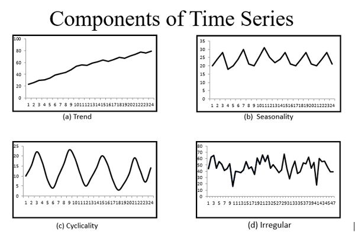

<h1 align='center'> Time Series Learning </h1>
<br>
<hr>
<h2 align='left'>Part I: The Theoretical Bedrock of Time Series Analysis </h2>
<p>
    A robust understanding of the statistical properties inherent in time-series data is the indispensable foundation upon which all reliable forecasting models are built. <b> Without this theoretical grounding, the application of even the most sophisticated machine learning algorithms becomes a high-risk exercise in pattern-matching without comprehension, often leading to models that are brittle, misleading, and perform poorly on unseen data.</b> This section establishes that essential foundation, covering the core components of time series, the critical concept of stationarity, and the diagnostic tools used to identify underlying data structures.
</p>
<hr>
<h3 align='left'>1.1 Deconstructing Time Series: Trend, Seasonality, and Stationarity</h3>
<p>
    <b>Time series is an art and science of understanding data points ordered throughout time.</b>The initial and most crucial step of forecasting project is to decomppose the observed points into its components to understand its underlying structure.
    <br>
    These components are typically categorized as: 
    <ol>
        <li> Trend </li>
        <li> Seasonality </li>
        <li> Cyclicity </li>
    </ol>
</p>
<br>
<ol>
    <li> Trend </li> <p> &nbsp;&nbsp; It is long term underlying movement of the series.It is the persistent long run increase or decrease of the data. Such as steady growth of revenue over several years </p>
    <li> Seasonality </li><p>&nbsp;&nbsp; It is predictable, repeating pattern or fluctuations that occur at regular interval. For example, retail sales often exhibit strong weekly seasonality (higher on weekends) and yearly  </p>
    <li> Cyclicity </li><p>&nbsp;&nbsp; It is pattern that repeats over time but are not fixed. Calendar based periods, Business cycles may show expansion and contraction over several years </p>
</ol>

<p> The figure below gives general idea of all major components </p>

<br>
<p><b>The primary objective of many forecasting methodologies is to isolate, model, and extrapolate these components to predict future values. </b></p>
<hr>

<h4> The Concept of Stationarity </h4>
<p>Among the properties of a time series, stationarity is paramount, particularly for classical statistical models. <b> A Time Series is considered stationary if its statstical properties, specifically mean, variance and autocovariance structure remains constant over time </b> In simpler terms <b> A Stationary series doesn't exhibit a trend or predictable seasonality pattern </b> Its behavior is consistant no matter when it is observed.</p>

<p> Whenever we use model like <p> ARIMA (Autoregressive Integrated Moving Average)</p> It is crucial that the time series is infact stationary in nature.Because they are designed to model relationships in a stable, time-invariant environment. Attempting to apply these models to non-stationary data can result in spurious correlations and a model that fails to generalize, producing unreliable forecasts.</p>


<hr>

<h4> Steps for Time Series Analysis </h4>
<p> Any standard Time series analysis comprises of 2 major steps, first is to identify the characteristics of the graph (identify trend, Seasonality and Cyclicity). Then Convert the time series to stationary if needed for further analysis </p>

<ul>
    <li> Step 1: Visual Inspection for Identification </li>
    <p> The first and most intuitive step is alwys to create a time series plot of the data. <b> Visual analysis serves as the primary diagnositic tool to detect obvious features like trend and seasonality. </b> Plotting aggregated data like the mean flow for each month of the year can reveal the underlying seasonal pattern unambigiously </p>
    <li> Step 2: Differencing to have Stationarity </li>
    <p> If visual inspection reveals non-stationarity, the most common technique to stabilize the series mean is differentiating. <b> The process invovlves creating new time series of the differences between consecutive observations </b> Differencing are of following types: </p>
        <ol>
            <li> First Order Difference </li>
            <p> First order difference removes the trend, leaving a series of period over period changes.</p>
            <li> Seasonal Difference</li>
            <p> It is applied where the value from the previous season is subtracted. For monthly data with a yearly seasonality, this would be a lag-12 difference </p>
            <li> Both Trend and Seasonality </li>
            <p> To obtain stationarity time series we initially do seasonal difference to remove seasonality and if trend is still persistent on it we do first order difference on it </p>
</ul>

### 📈 Differencing in Time Series Analysis

**Differencing** is a technique used to make a **non-stationary** time series **stationary** by removing trends and/or seasonality. A stationary series has statistical properties (like mean and variance) that do not change over time, which is often a requirement for many time series forecasting models (e.g., ARIMA).

---

### 1️⃣ First-Order Differencing (for Trend)

This technique is used to remove a **linear or near-linear trend** from the data.

#### Formula

The first difference at time $t$ is the value at $t$ minus the value at the previous period ($t-1$):

$$
y_{t}' = y_{t} - y_{t-1}
$$

### Example (Removing Trend)

| Time | Original ($y_t$) | First Difference ($y_t' = y_t - y_{t-1}$) |
| :--: | :-------------: | :-------------------------------------: |
| t=1  | 10              | —                                       |
| t=2  | 12              | 2                                       |
| t=3  | 14              | 2                                       |
| t=4  | 16              | 2                                       |
| t=5  | 18              | 2                                       |

**New Series:** $2, 2, 2, 2 \rightarrow$ **✅ Stationary** (trend removed, as mean and variance are constant).

---

### 2️⃣ Seasonal Differencing (for Seasonality)

This technique is used to remove a **repeating seasonal pattern** that occurs every $s$ periods.

### Formula

The seasonal difference at time $t$ is the value at $t$ minus the value from the same period in the previous cycle ($t-s$):

$$
y_{t}' = y_{t} - y_{t-s}
$$

Where $s$ is the **seasonal period** (e.g., $s=12$ for monthly data with yearly seasonality, or $s=4$ for quarterly data).

### Example (Quarterly Data, $s=4$)

| Quarter | $y_t$ | Seasonal Difference ($y_t - y_{t-4}$) |
| :-----: | :---: | :-----------------------------------: |
| Q1\_2021 | 10    | —                                     |
| Q2\_2021 | 20    | —                                     |
| Q3\_2021 | 10    | —                                     |
| Q4\_2021 | 20    | —                                     |
| Q1\_2022 | 11    | 1 (11 - 10)                           |
| Q2\_2022 | 21    | 1 (21 - 20)                           |
| Q3\_2022 | 11    | 1 (11 - 10)                           |
| Q4\_2022 | 21    | 1 (21 - 20)                           |

**New Series:** $1, 1, 1, 1 \rightarrow$ **✅ Stationary** (seasonality removed).

---

### 3️⃣ Combined Differencing (Trend + Seasonality)

When a series exhibits **both a trend and a seasonal pattern**, both types of differencing are applied. The order generally doesn't matter mathematically, but it's often preferred to apply the **seasonal difference first** to stabilize the variance associated with seasonality.

### Step 1: Seasonal Differencing (Remove Seasonality)

First, apply the seasonal difference to the original series $y_t$:
$$
y_{t}' = y_{t} - y_{t-s}
$$

### Step 2: First-Order Differencing (Remove Remaining Trend)

Next, apply the first-order difference to the *new, seasonally-differenced* series $y_{t}'$:
$$
y_{t}'' = y_{t}' - y_{t-1}'
$$

This combined approach is typical for series like **monthly sales data** where both a long-term growth (trend) and a yearly cycle (seasonality, $s=12$) are present.
<hr>

## 🕰️ Time Series: ACF and PACF Explained

The **Autocorrelation Function (ACF)** and the **Partial Autocorrelation Function (PACF)** are essential tools for identifying the underlying structure (like AR or MA) of a time series.

***

### ✅ What is ACF (Autocorrelation Function)?

ACF measures the **linear relationship** between an observation at the current time ($X_t$) and observations at previous time steps ($X_{t-k}$), known as lags. It includes both **direct and indirect effects**.

| Lag | Relationship Measured | Key Feature |
| :---: | :--- | :--- |
| **Lag 1 ACF** | Correlation between $X_t$ and $X_{t-1}$ | Only direct effect. |
| **Lag 2 ACF** | Correlation between $X_t$ and $X_{t-2}$ | Includes both direct correlation and **indirect effects** (passing through $X_{t-1}$). |
| **Lag $k$ ACF** | Correlation between $X_t$ and $X_{t-k}$ | Includes the **direct effect** and the **cumulative indirect effects** from all intermediate lags ($X_{t-1}, \dots, X_{t-k+1}$). |

**Used for:** Determining the order ($q$) of a **Moving Average ($\text{MA}(q)$)** model, as the ACF typically **cuts off** (drops to near zero) after $q$ significant lags.

***

### ✅ What is PACF (Partial Autocorrelation Function)?

PACF measures the **direct correlation** between an observation at the current time ($X_t$) and an observation at a previous time step ($X_{t-k}$), **after removing the linear effects of all the observations in between** ($X_{t-1}, X_{t-2}, \dots, X_{t-k+1}$).

| Lag | Relationship Measured | Purpose |
| :---: | :--- | :--- |
| **Lag 1 PACF** | Same as Lag 1 ACF. | No intermediate lags to account for. |
| **Lag 2 PACF** | Correlation between $X_t$ and $X_{t-2}$ **after removing the influence of $X_{t-1}$**. | To isolate the true direct correlation path. |
| **Lag 3 PACF** | Correlation between $X_t$ and $X_{t-3}$ **after removing the influence of $X_{t-1}$ and $X_{t-2}$**. | Helps detect the true order of AR terms. |

**Used for:** Determining the order ($p$) of an **Autoregressive ($\text{AR}(p)$)** model, as the PACF typically **cuts off** after $p$ significant lags.

<hr>

## Time Series Analysis: Mean, ACF, and PACF Calculation

**Series $X$:**
$$
X=[2, 4, 6, 8, 10, 12]
$$

We will compute: Mean, ACF at lags 1, 2, 3, PACF at lag 1 and lag 2, and provide an interpretation.

### ✅ STEP 1 — Compute the Mean

The mean ($\bar{X}$) is calculated as:
$$
\bar{X} = \frac{2 + 4 + 6 + 8 + 10 + 12}{6} = \frac{42}{6} = 7
$$

We'll use deviations from the mean ($Y_t = X_t - \bar{X}$) for correlation calculations:

| $t$ | $X_t$ | $X_t - \bar{X}$ |
| :---: | :---: | :---: |
| 1 | 2 | -5 |
| 2 | 4 | -3 |
| 3 | 6 | -1 |
| 4 | 8 | +1 |
| 5 | 10 | +3 |
| 6 | 12 | +5 |

The mean-adjusted series $Y$ is:
$$
Y=[-5, -3, -1, 1, 3, 5]
$$

### ✅ STEP 2 — Compute ACF

The general ACF formula at lag $k$ is:
$$
\rho_k = \frac{\sum_{t=k+1}^{n} (Y_t)(Y_{t-k})}{\sum_{t=1}^{n} Y_t^2}
$$

First, compute the **denominator** (Total Sum of Squares), which is constant for all lags:
$$
\sum_{t=1}^{6} Y_t^2 = (-5)^2 + (-3)^2 + (-1)^2 + 1^2 + 3^2 + 5^2 = 25 + 9 + 1 + 1 + 9 + 25 = 70
$$

**✅ ACF at Lag 1 ($\rho_1$):**
Pairs: $(Y_2, Y_1), (Y_3, Y_2), (Y_4, Y_3), (Y_5, Y_4), (Y_6, Y_5)$
Numerator:
$$
\sum (Y_t \cdot Y_{t-1}) = (-3)(-5) + (-1)(-3) + (1)(-1) + (3)(1) + (5)(3) \\
= 15 + 3 - 1 + 3 + 15 = 35
$$
So:
$$
\rho_1 = \frac{35}{70} = \mathbf{0.5}
$$

**✅ ACF at Lag 2 ($\rho_2$):**
Pairs: $(Y_3, Y_1), (Y_4, Y_2), (Y_5, Y_3), (Y_6, Y_4)$
Numerator:
$$
\sum (Y_t \cdot Y_{t-2}) = (-1)(-5) + (1)(-3) + (3)(-1) + (5)(1) \\
= 5 - 3 - 3 + 5 = 4
$$
So:
$$
\rho_2 = \frac{4}{70} \approx \mathbf{0.0571}
$$

**✅ ACF at Lag 3 ($\rho_3$):**
Pairs: $(Y_4, Y_1), (Y_5, Y_2), (Y_6, Y_3)$
Numerator:
$$
\sum (Y_t \cdot Y_{t-3}) = (1)(-5) + (3)(-3) + (5)(-1) \\
= -5 - 9 - 5 = -19
$$
So:
$$
\rho_3 = \frac{-19}{70} \approx \mathbf{-0.2714}
$$

| Lag | ACF |
| :---: | :---: |
| 1 | 0.50 |
| 2 | 0.057 |
| 3 | -0.271 |

### ✅ STEP 3 — Compute PACF

**👉 PACF at lag 1 ($\phi_{11}$):**
PACF at lag 1 is the same as ACF lag 1:
$$
\phi_{11} = \rho_1 = \mathbf{0.5}
$$

**👉 PACF at lag 2 ($\phi_{22}$):**
We use the Yule–Walker formula to remove the effect of lag 1:
$$
\phi_{22} = \frac{\rho_2 - \rho_1^2}{1 - \rho_1^2}
$$
Substitute the values $\rho_1=0.5$ and $\rho_2 \approx 0.0571$:
$$
\phi_{22} = \frac{0.0571 - (0.5)^2}{1 - (0.5)^2} = \frac{0.0571 - 0.25}{1 - 0.25} = \frac{-0.1929}{0.75} \approx \mathbf{-0.2572}
$$

| Lag | PACF |
| :---: | :---: |
| 1 | 0.50 |
| 2 | -0.257 |

### ✅ STEP 4 — Interpretation

* **ACF lag 1 ($0.50$):** Indicates a **moderate positive correlation** with the immediate past value.
* **ACF dies quickly:** The correlation drops off significantly after lag 1 (from $0.50$ to $0.057$), suggesting the influence of the past is primarily **direct**.
* **PACF lag 1 ($0.50$):** High direct correlation.
* **PACF lag 2 ($-0.257$):** This value is much smaller (in magnitude) than lag 1, suggesting that the $\text{ACF}$ seen at lag 2 and beyond is **mostly indirect** and explained by the relationship at lag 1.

**✅ Conclusion:**

The data shows a clear pattern of **strong direct dependence only at lag 1**. This is behavior highly consistent with a simple $\text{AR}(1)$ structure, where the current value is strongly dependent on the previous one, and little else. (This is expected since the series $X$ is perfectly linear, $X_t = X_{t-1} + 2$).

<hr>
<h2 align='left'>  Part 2: A Spectrum of Forecasting Models</h2>
<p>
    This section provides a structured learning path through these models, progressing from the interpretable and automated Prophet to the feature-intensive XGBoost, and finally to the probabilistic deep learning approaches of DeepAR and NeuralProphet. Mastering this spectrum is essential for fulfilling the core responsibility of pivoting between different models to address specific business problems.
</p>

<h3 align='left'>2.1. Meta's Prophet as Basline</h3>
<p>
Before jumping into complex models (like ARIMA, LSTMs, or Transformers), you always need a baseline — something fast, reliable, and interpretable to measure future improvements against.
Prophet is perfect for that because:
<ul>
    <li> It works well even with messy, real-world data </li>
    <li> It’s easy to use (minimal tuning needed) </li>
    <li> It handles seasonality, trends, and holidays automatically </li>
    <li> It gives interpretable components you can analyze </li>
</ul>
So instead of guessing what advanced model to use, Prophet gives you a solid starting point.
</p>

## ✅ Core Idea: Prophet Breaks Time Series into 4 Parts 🧱

Prophet, the forecasting model developed by Facebook (Meta), assumes your time series $y(t)$ is made up of four main components combined through an **additive model**:

$$
y(t) = g(t) + s(t) + h(t) + \epsilon_t
$$

Let's break these down in plain terms:

---

### 1️⃣ Trend — $g(t)$

This component captures the overall, non-periodic direction of the data over the long run.

* **What it represents:** Are values rising? Flattening? Saturating?
* **How Prophet models it:**
    * **Piecewise linear segments** (default): Assumes a constant growth rate that can change abruptly at automatically detected "changepoints."
    * **Logistic growth:** Used if there's a natural **ceiling/cap** to the series (e.g., market saturation).
* **Think of it as:**
    👉 *“Where is the time series heading in the long run?”*

---

### 2️⃣ Seasonality — $s(t)$

These are patterns that repeat at fixed, known intervals (e.g., daily, weekly, or yearly cycles).

* **Examples:**
    * **Daily:** Traffic spikes at rush hour.
    * **Weekly:** Restaurant rush on weekends.
    * **Yearly:** Retail holiday spikes.
* **How Prophet models it:** It uses **Fourier series** to mathematically approximate these smooth, repeating cycles.
* **Think of it as:**
    👉 *“What patterns repeat predictably over time?”*

---

### 3️⃣ Holidays / Events — $h(t)$

This component models the predictable but non-seasonal impact of special events, which often cause large, short-term spikes or drops.

* **Examples:** Christmas, Black Friday, local holidays, major company promotions, or strikes.
* **How Prophet models it:** You specify a dataframe of custom event dates, and Prophet estimates the *additive effect* of those events on the forecast.
* **Think of it as:**
    👉 *“What rare events cause spikes or drops?”*

---

### 4️⃣ Noise — $\epsilon_t$

This is the irreducible error or residual term.

* **What it represents:** Randomness, measurement error, or any short-term fluctuations that the deterministic model components ($g(t)$, $s(t)$, $h(t)$) cannot fully explain.
* **Think of it as:**
    👉 *“What’s left over after accounting for trend, seasonality, and events?”*

<hr>
<h3 align='left'>✅ Why Prophet Works So Well as a Baseline </h3>
<P>Prophet has two major strengths: <br></p>
<ol>
    <li> <b>Fully Automatic </b></li>
    <p>You can throw your dataset at it with:</p>
        ```
            model = Prophet()
            model.fit(df)
            forecast = model.predict(future)       
        ```
        And it just works — even with:
        Missing values
        Outliers
        Irregular frequency
        Complex patterns
    <li><b>Highly Tunable</b></li>
    <p>You can easily adjust things like:
        Change points in trend
        Strength of seasonality
        Custom holidays
        Growth saturation
        Regressors
    </p>
</ol>